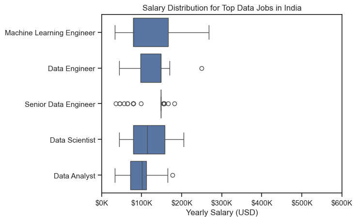
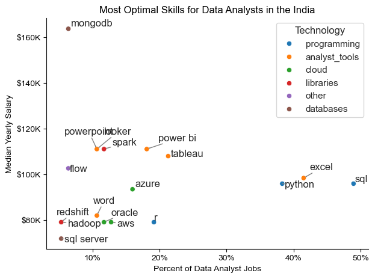

# Overview
This project explores insights into data jobs in India. What are the top jobs in the data field and what high paying skills and in-demand skills? It also shows which are the optimal skills to learn for those who are opting for data analysts.

# Questions

Below are the questions I want to answer in my project:

1. What are the most in demand skills for the top 3 most popular data roles?
2. How are in-demand skills trending for Data Analysts?
3. How well do jobs and skills pay for Data Analysts?
4. What are the optimal skills for data analysts to learn? (High Demand AND High Paying)

# Tools I Used

### Tools Used

* **Python**: Core language for analysis  
  - **Pandas**: Data manipulation  
  - **Matplotlib & Seaborn**: Data visualization  
* **Jupyter Notebooks**: For interactive analysis  
* **Visual Studio Code**: For coding  
* **Git & GitHub**: Version control 


# Data Preparation and Cleanup

```python

# Importing Libraries
import ast
import pandas as pd
import seaborn as sns
from datasets import load_dataset
import matplotlib.pyplot as plt  

# Loading Data
dataset = load_dataset('lukebarousse/data_jobs')
df = dataset['train'].to_pandas()

# Data Cleanup
df['job_posted_date'] = pd.to_datetime(df['job_posted_date'])
df['job_skills'] = df['job_skills'].apply(lambda x: ast.literal_eval(x) if pd.notna(x) else x)


```

# Filter India Jobs

```python 

df_IN = df[df['job_country'] == 'India']

```

# The Analysis

## What are the most demanded skills for the top 3 most popular data roles?

To find what are the in demand skills for the top most data jobs particularly in India, firstly I filtered out job_titles by which were the most popular, later got the top 5 skills for these top 3 roles. The following query highlights the most popular job_titles and their respective top skills, showing which skills I should pay attention to depending on the role I am targeting.

View the detailed steps here: 
[Skills_Demand.ipynb](Skills_Demand.ipynb)


```python

fig, ax = plt.subplots(len(job_titles),1)

sns.set_theme(style='ticks')
for i, job_title in enumerate(job_titles):
  df_plot = df_skills_perc[df_skills_perc['job_title_short']==job_title].head(5)
  #Matplotlib
  # df_plot.plot(kind='barh', x='job_skills', y='skill_percent', ax=ax[i], title=job_title)
  # ax[i].invert_yaxis() #highest to low
  
  #Seaborn for better visualization
  sns.barplot(data=df_plot, x='skill_percent',y='job_skills',ax=ax[i],hue='skill_percent',palette='dark:b_r')
  ax[i].set_title(job_title)
  ax[i].set_ylabel('')
  ax[i].set_xlabel('')
  ax[i].legend().remove()
  ax[i].set_xlim(0,78)

  #For getting percentage labels in visual
  for n, perc in enumerate(df_plot['skill_percent']):
    ax[i].text(perc+1, n, f'{perc:.0f}%', va='center') #va = vertical axis
  
  if i != len(job_titles)-1:
    ax[i].set_xticks([]) #to remove xticks for top 2
fig.suptitle('In-Demand Skills requested in Indian Job Postings', fontsize=15)
plt.tight_layout() #fix the overlap
plt.show()

```

### Results


### Insights

* Python is highly demanded skill across all the three roles, but most prominently for Data Scientist(70%) and Data Engineers(61%).
* SQL is the most requested skill for Data Analysts and Data Engineers.
* Data Engineers require more specialized technical skills in cloud(Spark, AWS, Azure).


## How are in-demand skills trending for Data Analysts?

```python

from matplotlib.ticker import PercentFormatter

df_plot = df_DA_IN_percent.iloc[:, :5] #all the rows but first 5 columns
sns.lineplot(data=df_plot, dashes=False,palette='tab10')

ax = plt.gca()
ax.yaxis.set_major_formatter(PercentFormatter())

```

### Results


### Insights:

* The demand for power bi is consistently increasing.
* SQL remains as the top most desirable skill for Data Analysts.
* We can see that the python is becoming most skill important as excel for Data Analyst roles.
* Python and tableau show relatively stable demand throughout the year with some fluctuations.


## Salary Analysis

```python 
sns.boxplot(data=df_IN_top6, x='salary_year_avg',y='job_title_short')
sns.set_theme(style='ticks')

ticks_x = plt.FuncFormatter(lambda y, pos: f'${int(y/1000)}K')
plt.gca().xaxis.set_major_formatter(ticks_x)
plt.show()

```

### Results



### Insights:

* Machine Learning Engineer has the highest median salary, suggesting it’s one of the most lucrative roles in the data field.
* Senior Data Engineer and Data Engineer also have high median salaries but show significant variability.
* Data Analyst has the lowest median salary among the listed job.


## Investigate Median Salary Vs Skill for Data Analysts


### Insights:
* High Salary ≠ High Demand: Skills that command the highest salaries (like PostgreSQL, PySpark, and Databricks) aren’t necessarily the most sought-after in the job market, where fundamentals like SQL, Excel, and Python dominate.

* Specialization Pays in Data Engineering & Big Data: Roles requiring specialized skills in data engineering and big data (e.g., PySpark, Scala, and cloud platforms) tend to offer higher pay, suggesting that advanced technical expertise can significantly boost earnings.

* Narrow Pay Range Among Top-Paid Skills: The median salaries across the top-paid skills are very close, indicating that rather than one “best” skill, a combination of several high-paying skills may be the key to maximizing salary potential.


## What is the most optimal skill to learn for Data Analysts?

View detailed code and customization here:
[Optimal_skills.ipynb](Optimal_Skills.ipynb)


```python

from adjustText import adjust_text
import matplotlib.pyplot as plt

plt.scatter(df_DA_skills_high_demand['skill_percent'], df_DA_skills_high_demand['median_salary'])

plt.show()

```



### Insights:

* High-Demand vs. High-Pay Skills: SQL and Python are the most in-demand skills (appearing in nearly 50% of data analyst job postings), but they don't offer the highest salaries. In contrast, MongoDB, which appears in fewer job postings, commands one of the highest median salaries.

* Cloud and Database Skills Drive Higher Salaries: Skills like MongoDB, Redshift, and Spark tend to yield higher salaries, suggesting that expertise in cloud computing and big data technologies can significantly boost earning potential.

* Analyst Tools Are a Good Balance of Demand and Pay: Tools like Power BI, Tableau, and Spark strike a balance between demand and salary, making them optimal for data analysts looking for both job opportunities and competitive compensation.


# Conclusion

This exploration into the data analyst job market has been incredibly informative personally for me as an aspiring data analyst. This project highlights key skills for aspiring Data Analysts. As the job market evolves, staying updated with high-demand and high-paying skills will be crucial for career growth.

##### Happy Learning!
